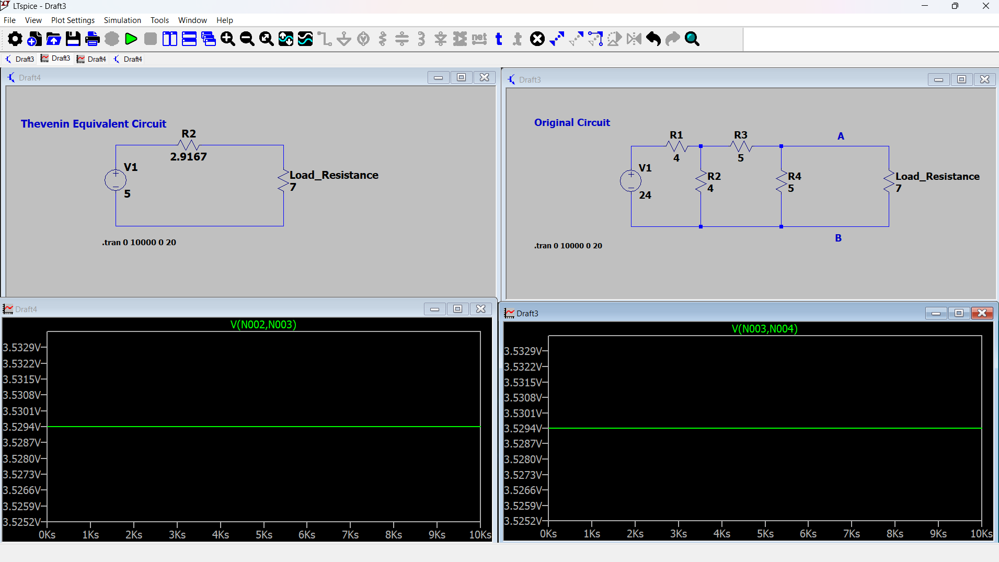
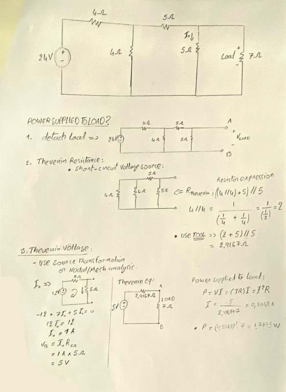

# Thevenin Equivalent Circuit Tool

This is a starter project I created after completing my "Basic Circuit Analysis" course.

One of the most fascinating theorems I encountered was the Thevenin Equivalence. I found the ability to reduce complex circuits into simple, digestible "grade 1" equivalents genuinely mesmerizing.

It took me some time to fully grasp the theory, so I built this project both as a way to help other engineering newcomers visualize and interact with the concept — and as a "capstone" for what I've learned this past semester.

This project reflects key topics from both circuit theory and programming, including:

- C++ programming methodology
- Inheritance and operator overloading
- File and exception handling

---

### Validating the Tool

Here's an example used to verify the correctness of this tool:

#### LTSpice Circuit

#### Hand-solved Problem
